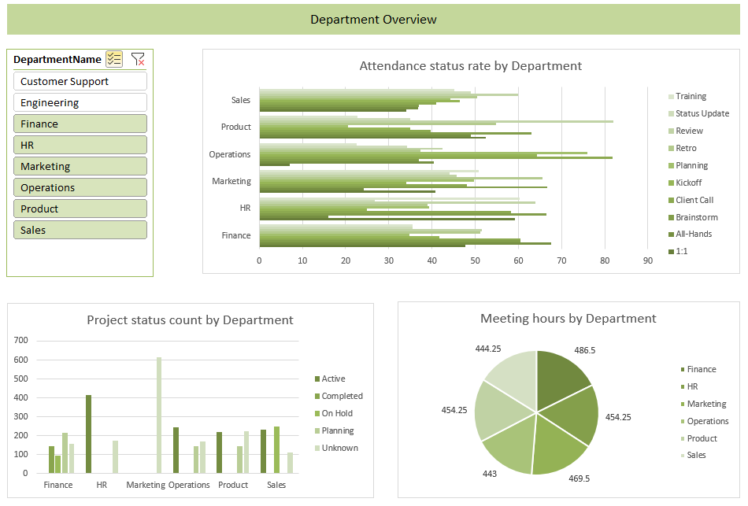
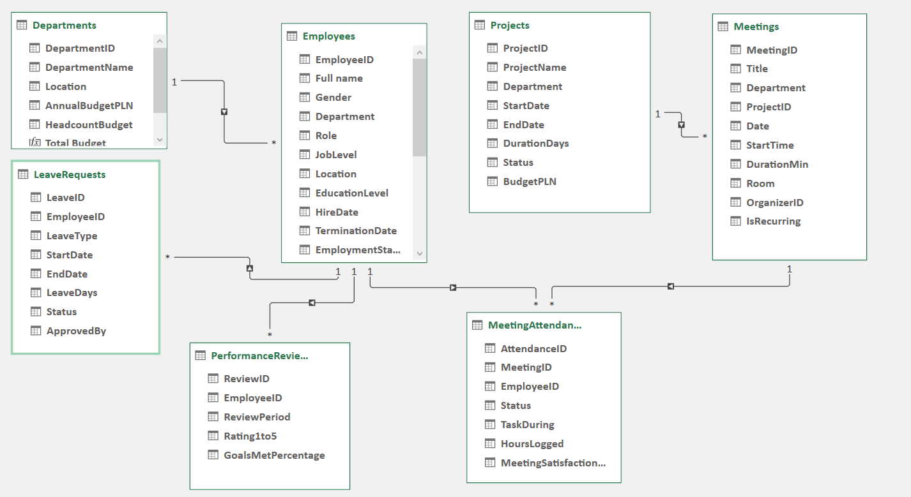
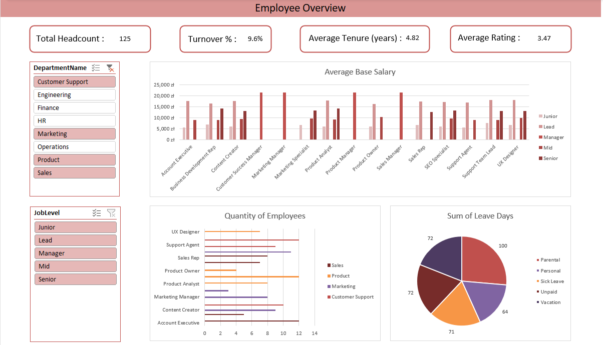
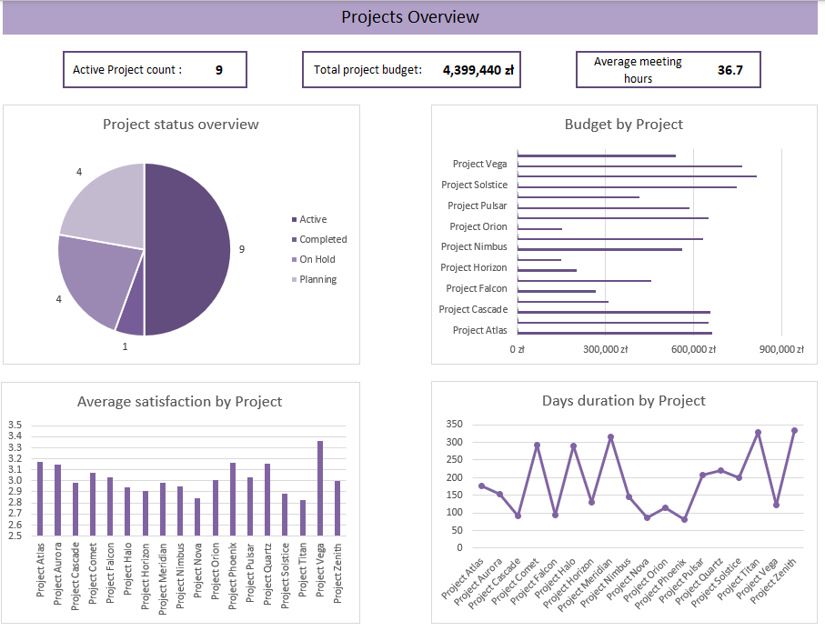

# Workforce & Meetings Analytics Dashboard

An Excel dashboard project analyzing employees, departments, projects, and meetings across a company - built on a relational data model rather than a single flat table. Built as a portfolio project to practice data modeling, DAX, and dashboard design.

## Technologies Used

- Microsoft Excel
- Power Query - data cleaning and loading
- Power Pivot - data model and table relationships
- DAX - calculated measures
- PivotTables, PivotCharts, and Slicers

## Data

Synthetically generated to model realistic HR and operations data - not from a real company. 7 related tables, connected as a star schema with Departments as the central hub:

| Table | Contents |
|---|---|
| Departments | Name, location, budget, budgeted headcount |
| Employees | Role, job level, salary, hire/termination date, manager |
| Projects | Name, department, timeline, status, budget |
| Meetings | Date, time, duration, department, linked project |
| MeetingAttendance | Who attended which meeting, status, satisfaction score |
| LeaveRequests | Leave type, dates, days taken, approval status |
| PerformanceReviews | Quarterly rating and goals met per employee |

## Business Questions

- What's the turnover rate by department and job level?
- Which departments are over/understaffed vs. their budget?
- How many hours does each department spend in meetings, and how satisfied are people with them?
- Which projects burn disproportionate meeting time relative to their budget?
- How has performance trended over the last two years?

## Key Measures (DAX)

- **Turnover Rate %** - terminated / total employees
- **Average Tenure** - avg. years between hire date and termination date (or today)
- **Active Project Count / Budget** - filtered to Status = Active
- **Avg Meeting Hours per Project** - total meeting hours / distinct projects with meetings

## Dashboards

### Employee Overview
KPI cards (headcount, turnover, tenure, rating). Charts show average salary by role and job level, employee count by role and department, and leave days by type. Filterable by Department and Job Level slicers.

### Department Overview
Side-by-side comparison of all departments - meeting hours, attendance status rate, project status counts. Multi-select department slicer.

### Projects Overview
KPI cards (active projects, active budget, avg meeting hours) plus budget, status, satisfaction, and duration per project.

## Planned Additions

- Employee Profile view - dropdown lookup of a single employee's stats. Not yet built.

## Author

[Your name] - [LinkedIn / portfolio link]
